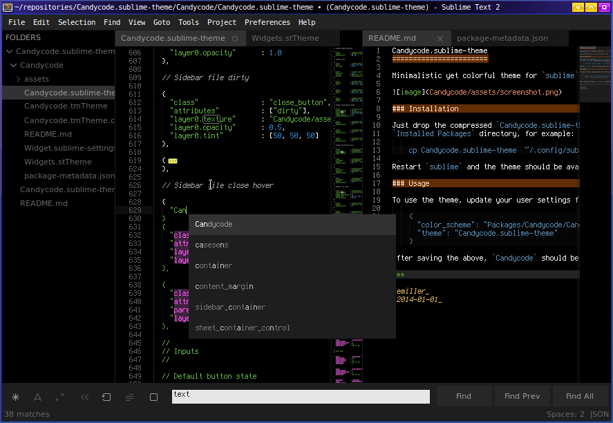

Candycode.sublime-theme
=======================

Minimalistic yet colorful theme for `sublime`.

### Installation

Just drop the compressed `Candycode.sublime-theme` package into the `sublime`
`Installed Packages` directory, for example:

    cp Candycode.sublime-theme  ~/.config/sublime-text-2/Installed\ Packages/

Restart `sublime` and the theme should be available.

### Usage

To use the theme, update your user settings file:

    {
      "color_scheme": "Packages/Candycode/Candycode.tmTheme",
      "theme": "Candycode.sublime-theme"
    }

After saving the above, `Candycode` should be applied.

***

_emiller_  
_2014-01-01_
